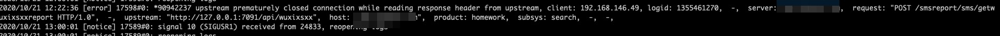

## nginx 502

Q：ngixn 反向代理请求至 go 服务, go 服务接口正常返回，nginx 返回 502

排查相关服务日志后发现 nignx error log

通过 go 服务日志看请求总耗时 880ms，由于 go 服务配置了 http 接口读写超时时间为 800ms，导致 go 服务主动断开了与 nginx 的连接，导致 nginx 响应 502，通过调整 go 服务接口读写时间解决此问题

